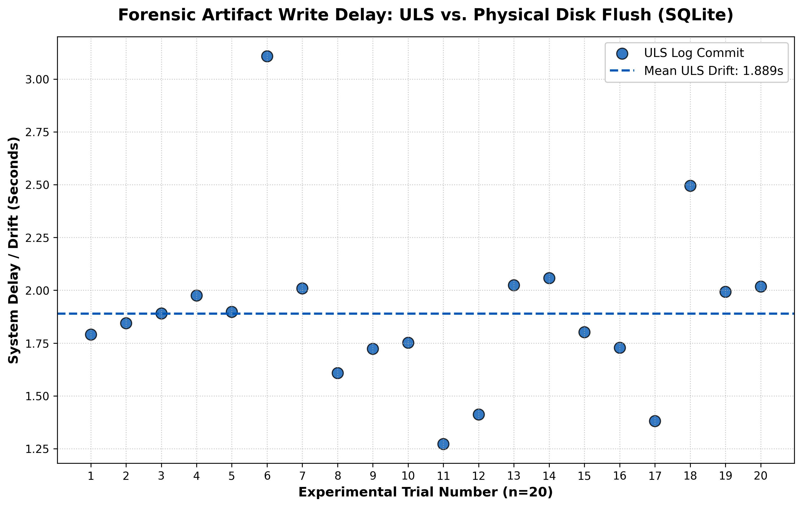

# macos 14
# Part 2: Unified Log vs. Physical Disk Flush Delay

We upgraded our forensic harness (`unified_drift_analysis.py`) to monitor the physical hard drive in real-time alongside the macOS Unified Log (ULS) stream. 

Using kernel-level `watchdog` events, we tracked the exact moment the system modified the Classic `.plist` file and the SQLite Write-Ahead Log (`-wal`) files following a connection event.

## Raw Data Table (n=20 Trials)

| Trial | Log Drift (s) | Paired WAL | Classic `.plist` |
| :---: | :---: | :---: | :---: |
| 1 | 1.790 | No Change | No Change |
| 2 | 1.845 | No Change | No Change |
| 3 | 1.891 | No Change | No Change |
| 4 | 1.976 | No Change | No Change |
| 5 | 1.898 | No Change | No Change |
| 6 | 3.108 | No Change | No Change |
| 7 | 2.009 | No Change | No Change |
| 8 | 1.609 | No Change | No Change |
| 9 | 1.723 | No Change | No Change |
| 10 | 1.751 | No Change | No Change |
| 11 | 1.273 | No Change | No Change |
| 12 | 1.413 | No Change | No Change |
| 13 | 2.024 | No Change | No Change |
| 14 | 2.058 | No Change | No Change |
| 15 | 1.802 | No Change | No Change |
| 16 | 1.728 | No Change | No Change |
| 17 | 1.381 | No Change | No Change |
| 18 | 2.495 | No Change | No Change |
| 19 | 1.993 | No Change | No Change |
| 20 | 2.018 | No Change | No Change |

---

## Visualization

## Forensic Analysis

### 1. Volatile Memory Priority
Our data shows that the Unified Logging System (ULS) registers connection events with a mean drift of **~1.889 seconds**. This confirms that macOS prioritizes rapid, volatile logging for debugging and continuity.

### 2. The "No Change" Finding
In all 20 trials, the physical SQLite databases (`.db-wal`) and configuration files (`.plist`) showed **No Change** within the 10-second observation window. 

This confirms a critical forensic vulnerability: **Lazy Writing.** macOS does not immediately commit Bluetooth connection telemetry to the SSD. Instead, it caches this data in RAM. If an investigator relies solely on a "dead-box" SSD image, they will likely miss connection events that were only ever stored in volatile memory, effectively creating a "Forensic Blind Spot" for recent device activity.
