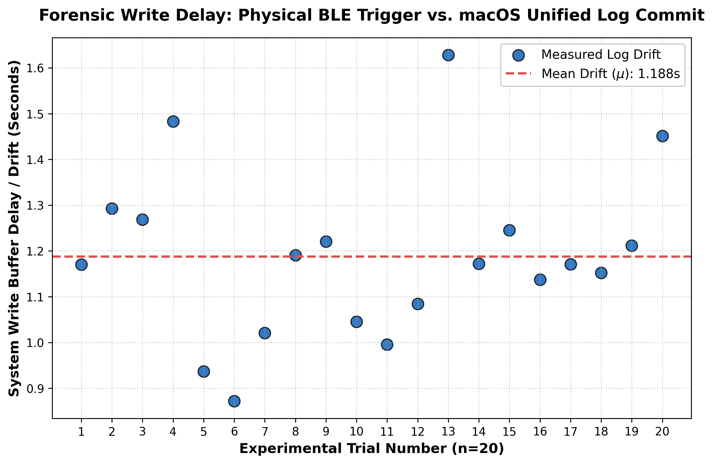

# Module B: Unified Log Timestamp Drift Results

Hey team, here are the final results from the Timestamp Drift experiment (Module B). 

To get these numbers, I wrote a Python script that automatically connected the **Sony WF-1000XM5** earbuds 20 times in a row. It measured the exact microsecond the physical connection was triggered and compared it to the timestamp that macOS actually wrote into the Unified Logging System (ULS).

## Raw Data Table (n=20)

| Trial Number | Measured Drift (Seconds) |
| :---: | :---: |
| 1 | 1.170191 |
| 2 | 1.292923 |
| 3 | 1.268986 |
| 4 | 1.482791 |
| 5 | 0.937067 |
| 6 | 0.871869 |
| 7 | 1.020919 |
| 8 | 1.190664 |
| 9 | 1.220591 |
| 10 | 1.045551 |
| 11 | 0.995695 |
| 12 | 1.084159 |
| 13 | 1.628130 |
| 14 | 1.171989 |
| 15 | 1.245043 |
| 16 | 1.137398 |
| 17 | 1.171108 |
| 18 | 1.152363 |
| 19 | 1.211761 |
| 20 | 1.451438 |

---

## Graph Analysis

Make sure to look at `Forensic_Drift_Figure.png` alongside this data. Here is how to explain the plot so everyone understands what is happening:

* **The Blue Dots (Measured Log Drift):** Each dot represents one of the 20 connection trials. If you look at the spread, the dots bounce around quite a bit. The fastest log write took about **0.87 seconds** (Trial 6), and the slowest took about **1.63 seconds** (Trial 13). 
* **The Red Dashed Line (Mean Drift):** This is the overall average delay across all 20 trials. It settles at exactly **1.188 seconds**.

## What this means for our research paper:
The graph proves that macOS does *not* instantly log Bluetooth connections. The OS batches the data in its memory buffer and writes it to the disk when it feels like it. 

**The big takeaway:** If a digital investigator is looking at a macOS Unified Log to figure out exactly when a suspect's phone or earbuds connected to a laptop, they cannot trust that timestamp down to the millisecond. They have to assume there is an average "margin of error" of about **1.2 seconds**, and sometimes it can fluctuate by nearly a full second.# Module B: Unified Log Timestamp Drift Results

Hey team, here are the final results from the Timestamp Drift experiment (Module B). 

To get these numbers, I wrote a Python script that automatically connected the **Sony WF-1000XM5** earbuds 20 times in a row. It measured the exact microsecond the physical connection was triggered and compared it to the timestamp that macOS actually wrote into the Unified Logging System (ULS).

## Raw Data Table (n=20)

| Trial Number | Measured Drift (Seconds) |
| :---: | :---: |
| 1 | 1.170191 |
| 2 | 1.292923 |
| 3 | 1.268986 |
| 4 | 1.482791 |
| 5 | 0.937067 |
| 6 | 0.871869 |
| 7 | 1.020919 |
| 8 | 1.190664 |
| 9 | 1.220591 |
| 10 | 1.045551 |
| 11 | 0.995695 |
| 12 | 1.084159 |
| 13 | 1.628130 |
| 14 | 1.171989 |
| 15 | 1.245043 |
| 16 | 1.137398 |
| 17 | 1.171108 |
| 18 | 1.152363 |
| 19 | 1.211761 |
| 20 | 1.451438 |

---

## Graph Analysis

Make sure to look at `Forensic_Drift_Figure.png` alongside this data. Here is how to explain the plot so everyone understands what is happening:

* **The Blue Dots (Measured Log Drift):** Each dot represents one of the 20 connection trials. If you look at the spread, the dots bounce around quite a bit. The fastest log write took about **0.87 seconds** (Trial 6), and the slowest took about **1.63 seconds** (Trial 13). 
* **The Red Dashed Line (Mean Drift):** This is the overall average delay across all 20 trials. It settles at exactly **1.188 seconds**.

## What this means for our research paper:
The graph proves that macOS does *not* instantly log Bluetooth connections. The OS batches the data in its memory buffer and writes it to the disk when it feels like it. 

**The big takeaway:** If a digital investigator is looking at a macOS Unified Log to figure out exactly when a suspect's phone or earbuds connected to a laptop, they cannot trust that timestamp down to the millisecond. They have to assume there is an average "margin of error" of about **1.2 seconds**, and sometimes it can fluctuate by nearly a full second.
